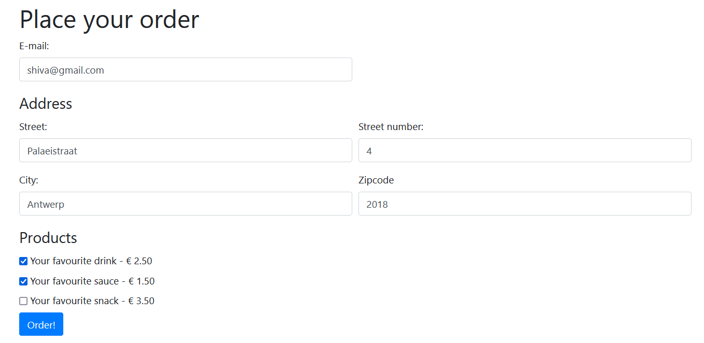
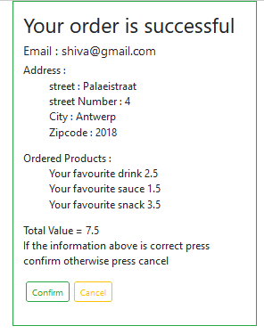

# order_form
Create a user order confirmation on form submit in php.

# Output

## 🌱 Must-have features

### Preparation
- Have a look at the provided structure: you get both an index file and another file containing a form. How are these two working together?
- Think of a funny / surprising / original name for a store that should definitely exist. (fancy suits for cats? bongo for dates? you name it!)
- Think of some products to sell (feel free to be creative) and update the products array with these.
- Check if all the products & prices are currently visible in the form.

### Step 1: accepting orders
- Show an order confirmation when the user submits the form. This should contain the chosen products and delivery address.
- We will learn how to save this information to a database later, so no need to do this now.

### Step 2: validation
- Use PHP to check the following:
    - Required fields are not empty. (Done)
    - Zip code are only numbers.(Done)
    - Email address is valid.(Done)
- Show any problems (empty or invalid data) with the fields at the top of the form. Tip: use the [bootstrap alerts](https://getbootstrap.com/docs/4.0/components/alerts/) for inspiration. If they are valid, the confirmation of step 1 is shown.
- If the form was not valid, show the previous values in the form so that the user doesn't have to retype everything.

> Usually, validation is a combination of server side checks (for security, these can't be bypassed) and checks in html / JS (can be bypassed but can give live user feedback).

### Step 3: improve UX by saving user data
- Check out the possibilities of the PHP session and cookies.
- We want to prefill the address (you can just use any previous user input, we don't need to get data from anywhere else), as long as the browser isn't closed. Which of these techniques is the better choice here?
